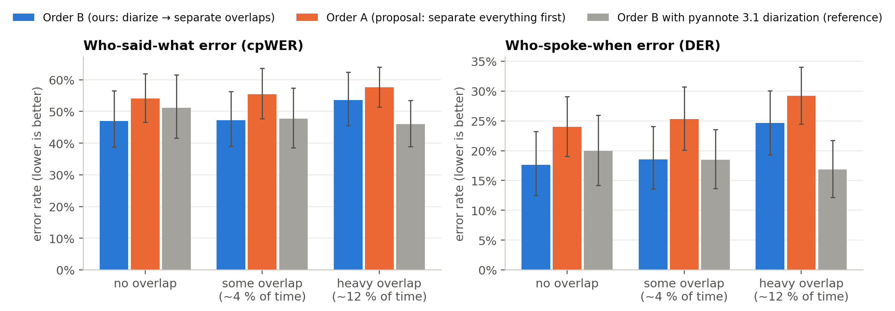

# whospoke — who spoke what, and when

**Speech separation, speaker diarization and Hindi/Hinglish transcription for noisy, overlapping, code-switched audio.**
CS F407 (Artificial Intelligence), BITS Pilani · Prof. Tirtharaj Dash
Team: Darshan Rajagoli · Vismay · Abhinav Padhi · Shrivaths Prabhu

Give it a recording of people talking over each other in Hindi and English, with a market or a village in the
background, and it produces:

```
[00:27 - 00:32] Speaker_A: sir mere koi galti hui mere haath se wo mera aai D card gum ho gaya hai sir
[00:32 - 00:33] Speaker_B: haan aur baki sun
[00:33 - 00:40] Speaker_A: haan chalo exam paas aa rahe hain to aai D card chahiye aadhar card ki photo kapi aur kya kya lana hai sir
[00:41 - 00:44] Speaker_B: apne camera si si ti V camera check karva lijie
[00:51 - 00:54] Speaker_A: to ab kab tak kitne baje tak office khula hai sir apna
```

a speaker timeline (`timeline.json`), a Devanagari transcript, a Hinglish transcript and subtitles (`.srt`).
(The excerpt is real output on a test conversation with heavy overlap and loud market noise; see [results/demo/](results/demo/).)

This covers Milestones 1–3 of the [project proposal](Audio_Engineering_AI_Project_Proposal.docx).
Milestone 4 (LLM clean-up) comes after the mid-semester review. **Navigation: [INDEX.md](INDEX.md).**

---

## Headline results

Measured on **72 test conversations (83 min)** built from real conversational Hindi (IndicVoices)
with real village/market noise. Test speakers were never used for tuning. Full results with 95 % confidence intervals
are in [docs/RESULTS.md](docs/RESULTS.md).

| | our pipeline (Order B) | proposal's order (Order A) |
|---|---|---|
| **who said what** — cpWER (words wrong or given to the wrong speaker) | **49.5 %** | 55.8 % |
| **who spoke when** — DER | **20.3 %** | 26.2 % |
| **separation quality** — SI-SDR improvement where people overlap | **+9.6 dB** (overlaps only) | +4.5 dB (whole recording) |

| stage | result |
|---|---|
| 1 · Separation | Conv-TasNet: +9.6 dB on overlaps. With the true timeline, splicing separated overlaps cuts heavy-overlap transcript errors from 35.5 % to 27.6 % |
| 2 · Diarization | Our spectral clustering: DER 20.3 %. GMM: 20.3 %. Off-the-shelf pyannote 3.1: 18.4 %. Ours and pyannote are within error bars |
| 3 · Transcription | IndicConformer: 21.0 % WER on real-world Vaani audio, vs 38.0 % for IndicWav2Vec. 78 % of English words inside Hindi recognised. 82 % of them spelled correctly in the Hinglish output |



**The one design change.** The proposal separates the whole recording first and then diarizes it (Order A). We built
that, and also an Order B: diarize first, then separate only the stretches where two people overlap. We ran both
on identical audio. Order B makes fewer errors in 50 of the 72 test conversations: on average 6.7 cpWER points less per conversation (95 % CI 4.0 to 9.4). Every difference from the proposal is listed in [DEVIATIONS.md](DEVIATIONS.md),
and every judgement call in [DECISIONS.md](DECISIONS.md).

## How it works

```
recording ─► Stage 2: who speaks when ─► Stage 1: separate only the overlapping turns ─► Stage 3: Hindi ASR ─► Hinglish
             (pyannote VAD + overlap      (Conv-TasNet, noise-trained)                   (IndicConformer)     romaniser
              detection, WeSpeaker voice
              fingerprints, our spectral
              clustering)
```

| Stage | Proposal asks for | We use | Details |
|---|---|---|---|
| 1 · Separation | Conv-TasNet or Demucs | Conv-TasNet (Libri2Mix noisy, 16 kHz), with windowing, gain fit and speaker-consistent stitching | [PIPELINE.md §1](docs/PIPELINE.md#stage-1--blind-source-separation-separationpy) |
| 2 · Diarization | pyannote + spectral clustering or GMM | pyannote segmentation + WeSpeaker embeddings; **both** clusterers written from scratch; pyannote 3.1 as a reference | [§2](docs/PIPELINE.md#stage-2--speaker-diarization-vadpy-diarizationpy-clusteringpy) |
| 3 · Transcription | IndicASR or IndicWav2Vec; native or Latin script | **Both** ASR models compared on real-world Vaani audio; Devanagari **and** Hinglish output | [§3](docs/PIPELINE.md#stage-3--regional--code-switched-transcription-asr_backendspy-hinglishpy-pipelinepy) |

## Setup

Tested on Windows 11, Python 3.12, an NVIDIA RTX 3050 (6 GB) and CUDA 12.1. The pipeline runs on CPU too, but slowly.
It also runs on Google Colab: see [notebooks/02_walkthrough.ipynb](notebooks/02_walkthrough.ipynb).

```bash
python -m venv venv && venv\Scripts\activate          # (Linux/macOS: source venv/bin/activate)
pip install torch==2.5.1 torchaudio==2.5.1 --index-url https://download.pytorch.org/whl/cu121
pip install -r requirements.txt
pip install --no-deps asteroid==0.7.0 onnxruntime-gpu==1.19.2
```

**Hugging Face access.** Several models and datasets are gated: log in once with `huggingface-cli login`, then click
"Agree" on each of these pages:
[pyannote/segmentation-3.0](https://huggingface.co/pyannote/segmentation-3.0) ·
[pyannote/speaker-diarization-3.1](https://huggingface.co/pyannote/speaker-diarization-3.1) ·
[pyannote/wespeaker-voxceleb-resnet34-LM](https://huggingface.co/pyannote/wespeaker-voxceleb-resnet34-LM) ·
[ai4bharat/indic-conformer-600m-multilingual](https://huggingface.co/ai4bharat/indic-conformer-600m-multilingual) ·
[ai4bharat/IndicVoices](https://huggingface.co/datasets/ai4bharat/IndicVoices) ·
[ARTPARK-IISc/Vaani-transcription-part](https://huggingface.co/datasets/ARTPARK-IISc/Vaani-transcription-part).
Noise comes from [DEMAND](https://zenodo.org/records/1227121) (CC-BY-4.0) and [ESC-50](https://github.com/karolpiczak/ESC-50) (CC-BY-NC), which are not gated.

**Data folder.** Corpora and simulated conversations (≈5 GB) go to `project/data` by default. To put them somewhere else,
set `WHOSPOKE_DATA` or write the path into a one-line `data_location.txt`.

## Run it

```bash
python -m whospoke run my_recording.wav                 # Order B, spectral clustering, IndicConformer
python -m whospoke run my_recording.wav --order A --clustering gmm --asr indicwav2vec --speakers 2
```

Outputs go to `results/runs/<file>/`. An example is in [results/demo/](results/demo/): a two-speaker test conversation with heavy overlap in 5 dB market noise, picked because its error is close to the test-set median (a typical case, not the best one).

## Reproduce every number

```bash
python scripts/fetch_data.py                          # DEMAND + ESC-50 noise, Vaani transcription shards
python scripts/build_dataset.py                       # dev + test conversations (downloads IndicVoices)
python scripts/mine_loanwords.py                      # Hinglish lexicon from Vaani *train*
python scripts/eval_separation.py --split dev         # Stage 1 checkpoint choice (dev)
python scripts/tune_diarization.py                    # Stage 2 settings (dev only) → results/tuned_params.json
python scripts/tune_separation_policy.py              # how Order B uses separated audio (dev only)
python scripts/eval_asr.py                            # Stage 3 model choice (Vaani test)
python scripts/eval_separation.py --split test        # Stage 1 on test
python scripts/evaluate.py --split test               # every system end to end on test
python scripts/make_report.py                         # tables + figures
python scripts/build_notebooks.py                     # executed notebooks
pytest                                                # fast tests; `pytest -m slow` runs the real models too
```

## Limitations (honest list)

- Test conversations are **simulated** from real speech: real turn-taking, reverberation and phone codecs are not
  modelled. A real broadcast has no ground-truth labels, so it cannot be scored.
- IndicConformer was trained on IndicVoices, so its IndicVoices numbers are optimistic. That is why the ASR model is
  chosen on Vaani instead (D19).
- At most two people talk at once. Conv-TasNet separates two voices.
- The Hinglish romaniser is rule-based plus a lexicon. It is readable, not a standard spelling.
