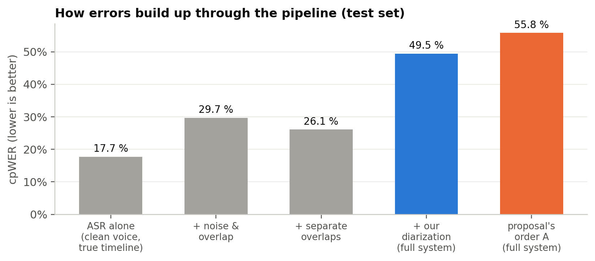

# Results — what we measured, and what it means

Every number here comes from [RESULTS_TABLES.md](RESULTS_TABLES.md), which `scripts/make_report.py` generates from
the CSVs in `results/`. Nothing below is typed in by hand without a source. Decision numbers (D#) point to
[DECISIONS.md](../DECISIONS.md).

## The short version (three claims, each with its evidence)

1. **The proposal's order (separate everything, then diarize) is worse than diarizing first and separating only
   the overlaps.** On the same 72 test conversations, Order A has cpWER **55.8 % vs 49.5 %** (who said what) and DER
   **26.2 % vs 20.3 %** (who spoke when). Per conversation, Order A makes on average **6.7 more cpWER points** of
   error (95 % CI +4.0 to +9.4) and **5.9 more DER points** (CI +4.0 to +7.8). It is worse in 50 of the 72.
2. **Separation works, when it is aimed at the overlaps.** Conv-TasNet improves the overlapping stretches by
   **+9.6 dB** SI-SDR, but the whole recording by only **+4.5 dB**. With the true speaker timeline, splicing the
   separated voices into the overlaps cuts transcript errors in heavy overlap from **35.5 % to 27.6 %**.
3. **Our from-scratch diarizer matches the off-the-shelf pyannote 3.1 pipeline within error bars**
   (cpWER 49.5 % vs 48.2 %; difference −0.8 points, CI −4.4 to +3.0). The Stage-3 model was chosen on independent
   real-world audio: IndicConformer has **21.0 % WER vs 38.0 %** for IndicWav2Vec on Project Vaani.

The largest remaining source of error is diarization: giving words to the wrong speaker. That is where the
post-midsem work should go (see "What limits the system" below).

---

## How we measured

**Test data.** 72 conversations, 83 minutes in total. Each is 2 or 3 speakers built from real conversational Hindi
(IndicVoices), with no overlap, some overlap (4 % of the time) or heavy overlap (11 %). Each is clean, or in a
village (10 dB SNR) or market (5 dB SNR) soundscape made from real field recordings (DEMAND + ESC-50). Eight groups
of speakers are each rendered in all 9 conditions, so any difference between conditions is caused by the condition,
not by different voices (D12). **All tuning used a separate dev set of 36 conversations with different speakers and
different noise recordings** (D13).

**Metrics** (lower is better unless stated):

| metric | question it answers | plain-English meaning |
|---|---|---|
| SI-SDR improvement (dB, higher is better) | Stage 1: how much cleaner is each voice after separation? | +10 dB ≈ the other voice is 10× quieter than before; 0 = no help |
| DER (diarization error rate) | Stage 2: who spoke when? | share of speaking time that is missed, falsely detected, or given to the wrong speaker (0.25 s tolerance at boundaries; overlapped speech counted) |
| WER / CER | Stage 3: what was said? | share of words / characters wrong |
| **cpWER** | all stages together: who said what? | WER after matching each found speaker to a real one; words given to the wrong speaker count as errors |

Confidence intervals are 95 % bootstrap intervals over conversations. Comparisons between systems are **paired**
(same conversations), which removes the variation between conversations.

---

## Stage 1 — separation

| where Conv-TasNet is applied | clean | village 10 dB | market 5 dB | all |
|---|---|---|---|---|
| **only the overlapping stretches** (what Order B does) | +10.6 dB | +8.3 dB | +9.8 dB | **+9.6 dB** (245 regions) |
| the whole recording (what Order A does) | +9.7 dB | +1.7 dB | +2.0 dB | **+4.5 dB** (24 recordings) |

On exactly the same 23 two-speaker conversations, overlap-only separation is **+5.6 dB better** (CI +3.8 to +7.6),
and it wins in 22 of the 23. In clean audio the two are close. The gap comes from noise: over a whole noisy
recording the separator has to decide what to do with minutes of background noise and single-speaker speech, and it
does that badly. It was trained on short, fully overlapped two-speaker clips, which is exactly what the overlap
regions look like.

**Checkpoint choice (on dev, D18):** the noise-trained Conv-TasNet (`sepnoisy`) beat the clean-trained one
(+6.4 vs +5.4 dB on dev overlaps; on test +9.6 vs +7.3 dB). SepFormer (WHAMR!) was far behind (+2.2 dB on test).
Demucs was not an option: its public checkpoints separate music, not speakers (D8).

**How to feed separated audio to the recogniser (on dev, D26).** Replacing a whole overlapping turn by its
separated version *hurt* the transcripts: the separator's artefacts spread over speech that was never overlapped.
Splicing the separated voice into **only the overlapped stretch** (0.5 s of context) worked best on dev. On test,
with the true timeline:

| audio given to the ASR | all | heavy overlap |
|---|---|---|
| the noisy mixture | 29.7 % | 35.5 % |
| **mixture with separated overlaps spliced in** | **26.1 %** | **27.6 %** |

Per conversation, splicing removes on average 3.0 points of error (paired CI +1.8 to +4.3).

## Stage 2 — diarization

| system (all Order B unless stated) | DER | missed | false alarm | wrong speaker | speaker-count error |
|---|---|---|---|---|---|
| **our spectral clustering** | **20.3 %** (17.3–23.6) | 6.7 % | 1.6 % | 11.9 % | 0.78 |
| our GMM | 20.3 % (17.2–23.4) | 4.7 % | 2.8 % | 12.9 % | 0.74 |
| pyannote 3.1 full pipeline (reference) | 18.4 % (15.5–21.4) | 3.9 % | 2.5 % | 12.0 % | 0.46 |
| Order A · spectral (tracks separated first) | 26.2 % (23.4–29.1) | 10.3 % | 3.0 % | 12.8 % | 0.82 |
| Order A · GMM | 26.7 % (23.7–29.9) | 10.6 % | 2.9 % | 13.2 % | 0.97 |
| true timeline (floor) | 8.7 % | 0 % | 8.7 % | 0 % | 0 |

- **Spectral vs GMM:** a tie on DER. Spectral is 1.2 cpWER points better, but that is within noise (CI −1.5 to +4.1).
  Spectral clustering is the default because it was better on dev (16.3 % vs 18.4 %, D22) and needs less clean-up.
  GMM depended heavily on the clean-up step: its dev DER was 27.7 % without it.
- **Why Order A diarizes worse:** after whole-recording separation, each track carries separator artefacts and
  leftover bits of the other voice. Voice fingerprints computed on those tracks are less reliable, and more speech
  is missed (10.3 % vs 6.7 %).
- **The "true timeline" row is not 0 %.** The reference turns bridge short pauses inside a turn, while scoring uses
  the exact speech activity, so the pauses count as false alarm. 8.7 % is the floor for any turn-based timeline.
- **Two speakers are harder than three for our diarizer** (DER 24.5 % vs 16.0 %). With only two voices, the speaker
  count is wrong in two thirds of the conversations. It finds just *one* speaker 36 % of the time and too many 31 % of
  the time, and merging two people into one is expensive. Fixing the count estimate for the two-speaker case is the
  most valuable next step.

## Stage 3 — regional & code-switched transcription

400 random single-speaker utterances per data set (D19, D24):

| model | Vaani test WER (real-world, chosen on this) | CER | English words inside Hindi recognised | IndicVoices WER | speed |
|---|---|---|---|---|---|
| **IndicConformer 600M** | **21.0 %** | **10.0 %** | **78 %** of 775 | 13.9 % | 18× faster than real time |
| IndicWav2Vec Hindi | 38.0 % | 16.8 % | 48 % of 775 | 36.1 % | 135× faster than real time |

IndicConformer's IndicVoices number is flattered, because it was trained on IndicVoices. That is why the choice
was made on Vaani, which neither model has seen. It wins there by 17 points.

**Hinglish output.** The romaniser (rules for Hindi's silent vowels plus a 2,600-word English-loanword lexicon)
spells **82.0 % of 8,630** English words spoken inside Hindi correctly in English, e.g. `ऑफिस` → `office`,
`मोबाइल` → `mobile`, `मीटिंग` → `meeting`. Words missing from the lexicon fall back to the rules and come out
phonetic: `कैंसल` → `kainsal` (cancel). The test words come from Vaani's *test* shards, and the lexicon was mined
only from *train* (D20).

## End to end — how errors build up

| step | cpWER | what the step adds |
|---|---|---|
| ASR on each clean voice, true timeline | 17.7 % | the recogniser's own error |
| + noise and overlap (mixture, true timeline) | 29.7 % | +12.0 points from noise and overlap |
| + separated overlaps (true timeline) | 26.1 % | separation wins back 3.6 points |
| + our diarization (the full system, Order B) | **49.5 %** | +23.4 points from who-spoke-when errors |
| the proposal's Order A (full system) | 55.8 % | +6.3 points more |

**Why diarization costs so much in cpWER.** A word given to the wrong speaker counts as an error twice: it is
missing from the right speaker and extra for the wrong one. So the 11.9 % of speaking time given to the wrong
speaker, plus the 6.7 % missed, more than doubles the word error. This is the standard property of cpWER, and it is
why it is the right metric for "who said what". Plain WER would hide the problem.

Once real diarization is used, separation still helps but only a little: 50.0 % without separation vs 49.5 % with
it (paired difference 0.5 points, CI −0.0 to +1.0). In heavy overlap it is 54.6 % vs 53.6 %. The benefit is limited
because when the diarizer gets the speakers wrong around an overlap, the right voice cannot be chosen.

## Speed and memory

Measured by [notebooks/01_benchmark.ipynb](../notebooks/01_benchmark.ipynb) on an RTX 3050 laptop GPU (6 GB), one
~70 s conversation per overlap × noise condition, with models already loaded:

| | separation | diarization | ASR | **total** | peak GPU memory |
|---|---|---|---|---|---|
| **Order B** | 0.005 | 0.009 | 0.048 | **0.062** (16× faster than real time) | 4.5 GB |
| Order A | 0.021 | 0.017 | 0.076 | 0.113 (9× faster than real time) | 4.4 GB |

Numbers are real-time factors: processing time ÷ audio length. Order B is also **~1.8× faster**, because it
separates a few seconds of overlap instead of the whole recording, and diarizes one stream instead of two. Cost grows
roughly linearly with length: 1 min of audio takes 4.3 s and 8 min takes 35 s. Model sizes: Conv-TasNet 5.1 M
parameters, pyannote segmentation 1.5 M, WeSpeaker ResNet-34 6.6 M, IndicConformer 600 M.

## What limits the system (and what we will do next)

1. **Diarization errors dominate** (23 of the ~50 cpWER points). Next steps: a better speaker-count estimate for
   the two-speaker case (it finds only one speaker in 36 % of two-speaker conversations), and using the overlap
   detector to add the second speaker without hurting the timeline.
2. **Simulated test data.** The conversations are built from real speech and real noise, but not recorded as real
   conversations. There is no room echo, no phone codec and at most two people at once. A real broadcast has no
   ground truth, so it cannot be scored.
3. **No fine-tuning** (6 GB laptop GPU). All models are used as released.
4. **Milestone 4** (LLM clean-up of the transcript) comes after the mid-semester review. Its input, the
   speaker-attributed transcript JSON, is already produced.

## Transparency note

Two problems were found while running the test set, fixed, and then the test set was re-run once. Both are logged
with before/after numbers:

- a crash caused by a global setting in a third-party library (D25);
- Order B was not actually separating anything, because it looked for overlapping *turns* instead of *detected
  overlaps* (D26).

The fix for the second problem was chosen on the dev set only. The first run's numbers are kept in
`results/eval_test_indicconformer_run1.csv`. The Order A vs Order B conclusion is the same in both runs
(55.8 % vs 50.0 % before the fix, 55.8 % vs 49.5 % after).
